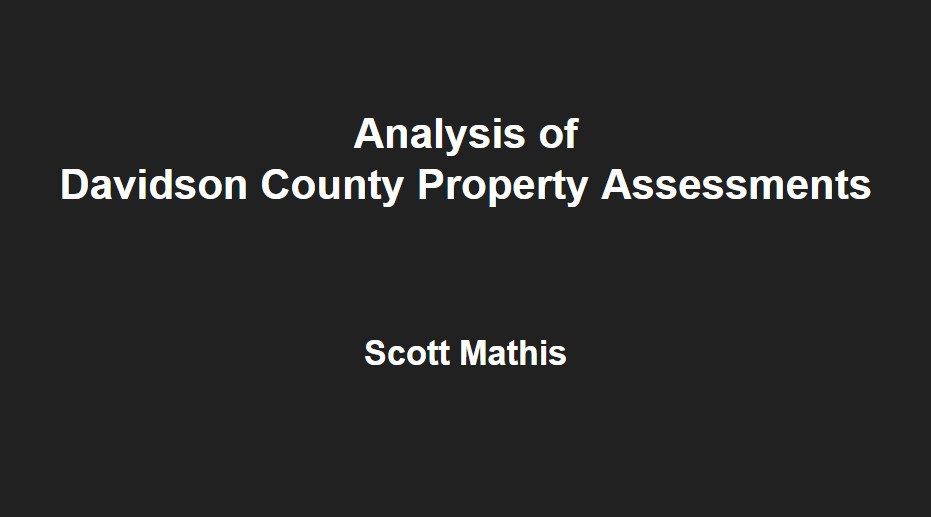
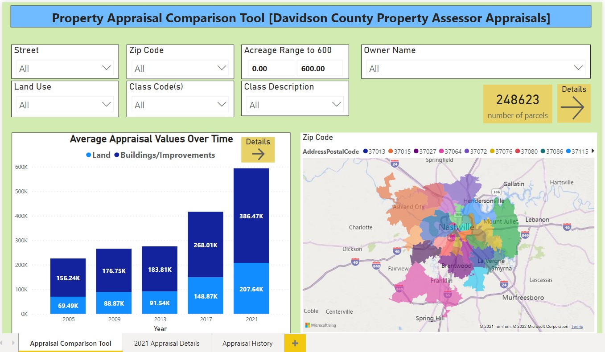

# Davidson County Real Property Assessments

## Analysis of Davidson County Real Property Assessments

## TABLE OF CONTENTS
* [Motivation](#motivation)
* [Data](#data)
* [Analytical Approach](#analytical-approach)
* [Tools Used](#tools-used)
* [Sources](#sources)

### MOTIVATION
No one relishes having to pay taxes, but taxes are necessary to fund government services and activities.  If we must pay taxes, at the very least, let us ensure taxation is implemented fairly, accurately and transparently.  With these principles in mind, I chose to analyze data from the Davidson County Property Assessor's Office which is used to calculate property taxes collected by Davidson County.  I explored the following:

- What anomalies, if any, exist in real property tax assessments in Davidson County?  What explains them?  What corrections are to be made?
- Beyond that, how can the data be presented and used in a way that property owners can trust their tax bill is fair and accurate?
- Can a tool be created to provide data transparency in an easier format for property owners to challenge their tax bill, if appropriate?

### DATA
To answer these questions, I used property appraisal and assessment data provided by the Davidson County Property Assessor's Office.  Data was provided in a combination of Access database files, Excel workbooks and txt files which were cleaned and merged in Python.

### ANALYTICAL APPROACH

#### Issues and Challenges:
I wanted to analyze the data to have confidence property taxes are being assessed fairly and accurately.  As I delved into it, I discovered the appraisal calculations are very complex, making detailed comparison difficult.  Additionally, many records had incomplete information.  Still, I wanted to use the skills I have been learning to examine the data the best I could.  

I had two goals.  First to discover any discrepancies and try to explain them, but then also to create a tool for comparing appraisals so property owners could have confidence in the fairness of their appraisals compared to others.  I identified parcels the data indicates should be taxed but are not. There may very likely be explanations for why these parcels are unassessed that are not present within the data itself.  However, for the purposes of my project, I proceeded with the assumption these parcels should be assessed.

This link is a presentation of my analysis.
https://docs.google.com/presentation/d/1g8WsJoRomkutwO1UWkyO-ePDdT53rzPMFn4YyK0raOw/edit?usp=sharing

I then used the data to create an appraisal comparison tool which I used to estimate potential tax revenue for some of these parcels.  However, the real value of the tool is to allow property owners to compare the appraised value of their property to similar properties to ensure they are being taxed fairly.  During the course of my analysis, I noticed large disparities in appraisal values in presumably similar properties.  However, given the complexity of these evaluations, it was beyond the scope of my analysis to explain them.  My objective was to identify their presence and allow users to extract this information for themselves.  There is a process to challenge property tax appraisals, but comparison data is required to do so.  This tools allows for that.

### TOOLS USED
- `Jupyter Notebook`, version 6.3.0 - platform to use Python code
- `Python/Pandas`, version 3.8.5 - for exploration, aggregation and visualization of the data
- `MS Power BI`, versoin 2.100.785.0 - for creating interactive dashboard
- `MS Access`, Microsoft 365 - for exporting data
- `MS Excel`, Microsoft 365 - for viewing data

### SOURCES
- 2021 REAPPRAISAL NASHVILLE & DAVIDSON COUNTY brochure
https://www.padctn.org/wp-content/uploads/2021/04/Brochure_2021.pdf
